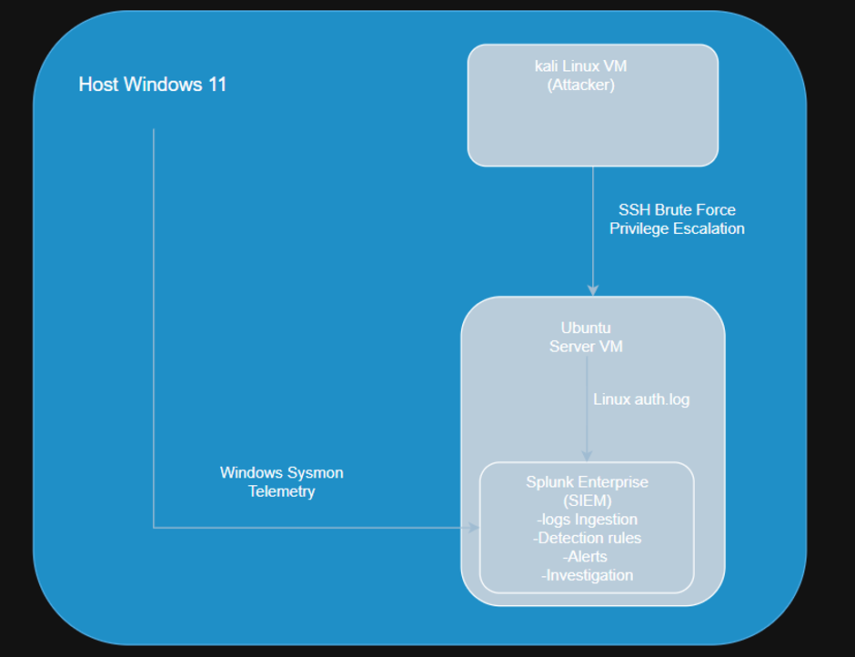
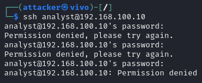
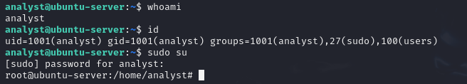
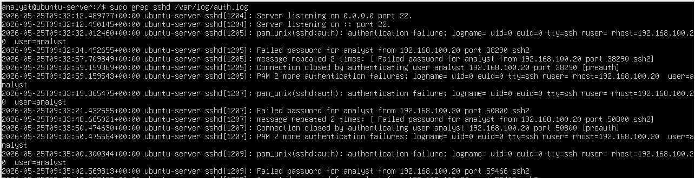

# SIEM Log Monitoring & Threat Detection using Splunk

## Project Summary

This project demonstrates the use of Splunk as a centralized SIEM platform to collect, monitor, and investigate security events from both Windows and Linux systems.

Attack scenarios included:

### Linux Attack Simulation
- SSH brute-force attempts against an Ubuntu server
- Privilege escalation using `sudo su`

### Windows Attack Simulation
- Encoded PowerShell execution
- PowerShell spawning a child process (calc.exe)

Logs from Linux auth.log and Windows Sysmon were ingested into Splunk and used to create custom detections, alerts, and investigation workflows.

## Objectives

- Collect and centralize Windows and Linux security telemetry
- Simulate attacker activity in a controlled lab environment
- Create custom detections and alerts in Splunk
- Investigate security events using raw logs and SIEM searches
- Gain hands-on experience with SIEM monitoring workflows

## Lab Architecture


*Fig 1 :Architecture Diagram of home lab*

The lab consisted of a Windows 11 host endpoint, an Ubuntu Server VM running Splunk Enterprise, and a Kali Linux VM used for attack simulation.

Windows Sysmon telemetry and Linux authentication logs were ingested into Splunk for centralized monitoring and investigation.

Kali Linux was used to simulate SSH brute-force activity and privilege escalation against the Ubuntu server.

## Tools Used

| Tool | Purpose |
|--------|---------|
| Splunk Enterprise | Centralized SIEM platform for log ingestion, detection, and investigation |
| Sysmon | Windows endpoint telemetry collection |
| Ubuntu Server VM | Hosted Splunk Enterprise and generated Linux authentication logs |
| Kali Linux VM | Attack simulation platform |
| VirtualBox | Virtualization environment |
| Windows 11 Host Endpoint | Generated PowerShell activity and Sysmon telemetry |


## Attack Scenarios

### Linux Attack Scenarios

#### Scenario 1 - SSH Brute Force

**Description**

Simulated repeated SSH authentication attempts from a Kali Linux VM (**192.168.100.20**) against an Ubuntu Server VM (**192.168.100.10**).

**Attack Simulation**

Multiple failed SSH login attempts were performed before successful authentication.



*Fig 2 :Failed SSH authentication attempts from the Kali Linux VM against the Ubuntu Server VM.*

**Outcome**
 
The brute-force activity generated multiple authentication failures that were successfully recorded in Linux auth.log and later ingested into Splunk for detection and analysis.

### Scenario 2 - Privilege Escalation

**Description**

Privilege escalation was performed on the Ubuntu Server VM after successful SSH authentication. The objective was to generate Linux authentication events associated with sudo activity and elevated privileges.

**Attack Simulation**

After successfully authenticating to the Ubuntu Server VM, the following command was executed:

`sudo su`



*Fig 3 :Privilege escalation performed using the sudo su command, resulting in a root shell on the Ubuntu Server VM.*

**Outcome**

Privilege escalation activity was successfully recorded in Linux auth.log through sudo-related events and root session creation records. These events were later ingested into Splunk for centralized monitoring and detection.

### Windows Attack Scenarios

#### Scenario 3 - Encoded PowerShell Execution

**Description**

A Base64-encoded PowerShell command containing a harmless payload that printed "Hello" was executed on the Windows 11 host endpoint to generate PowerShell process creation telemetry and validate endpoint visibility through Sysmon.

**Attack Simulation**

A PowerShell command containing an encoded payload was executed from the Windows endpoint.

`powershell -EncodedCommand VwByAGkAdABlAC0ATwB1AHQAcAB1AHQAIAAiAEgAZQBsAGwAbwAiAA==`


*Fig 4 :Execution of a Base64-encoded PowerShell command on the Windows 11 host endpoint.*

**Outcome**

The encoded PowerShell activity was successfully recorded by Sysmon, including command-line arguments and process execution details. The events were later ingested into Splunk for detection and analysis.


#### Scenario 4 - PowerShell Spawning Child Process

**Description**

PowerShell was used to spawn a child process (calc.exe) on the Windows 11 host endpoint. The objective was to generate process creation telemetry and validate visibility into parent-child process relationships through Sysmon.

**Attack Simulation**

The following PowerShell command was executed:

`powershell -WindowStyle Hidden "Start-Process calc "`


*Figure 5 - PowerShell spawning a child process (calc.exe) on the Windows 11 host endpoint.*

**Outcome**

Sysmon successfully recorded the parent and child process activity, providing visibility into PowerShell-driven process execution. The events were later ingested into Splunk for detection and analysis.

## Detection Strategy

### SSH Brute Force Detection

**Data Source**

Linux auth.log

**Objective**

Detect repeated failed SSH authentication attempts using Splunk SIEM


*Fig 6 :SSH login attempts failed results in splunk.*

**Detection Logic**

A Splunk search was created to identify multiple failed SSH authentication events within a short time period.


*Fig 7 :SSH brute-force detection rule created in splunk.*

**Validation**

The detection successfully identified historical brute-force activity recorded in auth.log. A new brute-force attack was later simulated after alert creation, resulting in successful real-time alert generation.


*Fig 8 :SSH brute-force alert generated in Splunk.*

### Privilege Escalation Detection

**Data Source**

Linux auth.log

**Objective**

Identify Linux session creation events that may indicate successful authentication or privilege escalation activity.

**Detection Logic**

A Splunk search was performed to identify session creation events recorded in Linux authentication logs.

```spl
source="/var/log/auth.log" index="main" "session opened"
```

**Validation**

The search successfully identified session creation events associated with user activity and elevated privileges. The results correlated with the previously observed sudo-based privilege escalation activity.


*Fig 9 :Privilege escalation detected in Splunk.*


### Encoded PowerShell Detection

**Data Source**

Windows Sysmon

**Objective**

Detect PowerShell executions containing encoded command-line arguments.

**Detection Logic**

A Splunk dsearch was created to identify PowerShell executions containing the EncodedCommand parameter. 


*Fig 10 :Splunk search used to identify encoded PowerShell execution.*

**Validation**

A Splunk alert was created using the detection logic and triggered on successfully identifying historical Sysmon events containing encoded PowerShell commands.


*Fig 11 :Trigger history for the encoded PowerShell alert.*

### PowerShell Child Process Detection

**Data Source**

Windows Sysmon

**Objective**

Detect processes spawned by PowerShell that may indicate suspicious post-exploitation activity.

**Detection Logic**

A Splunk search was created to identify Sysmon events containing PowerShell parent processes and child process creation activity.


*Fig 12 :Splunk search used to identify processes spawned by PowerShell..*

**Validation**

The search successfully identified Sysmon events where PowerShell launched a child process. The results confirmed that calc.exe was spawned by PowerShell and the alert triggered successfully.


*Fig 13 :Sysmon events showing PowerShell spawning calc.exe as a child process.*


*Fig 14 :Splunk alert successfully triggered on PowerShell child process activity.*

## Investigation

### Linux Investigation - SSH Brute Force

**1. Review Authentication Logs**

Linux authentication logs (`auth.log`) were reviewed to validate the alert and identify the source of the failed login attempts.



*Fig 15 :Authentication failures recorded in Linux auth.log.*

**2. Identify Source Host**

Analysis of the authentication records revealed repeated failed login attempts originating from the Kali Linux VM (**192.168.100.20**), confirming the source of the brute-force activity.

**3. Determine Attack Progression**

The investigation of the authentication logs confirmed that several failed password attempts occurred before a successful SSH login was achieved.


*Figure 16 - Successful SSH authentication recorded in Linux auth.log.*

**Investigation Findings**

The investigation confirmed that repeated SSH authentication failures originated from the Kali Linux VM (**192.168.100.20**) and targeted the Ubuntu Server VM (**192.168.100.10**). Multiple failed login attempts were observed before a successful authentication event was recorded. The activity was successfully captured in Linux authentication logs and detected by the custom Splunk rule.

### Linux Investigation - Privilege Escalation

**1. Review Authentication Logs**

Linux authentication logs (`auth.log`) were reviewed to identify sudo-related activity and root session creation events.


*Figure 17 - Sudo activity and root session creation recorded in Linux auth.log.*

**2. Identify Privileged Activity**

Analysis of the authentication logs revealed that the user analyst executed the following command after successfully authenticating to the Ubuntu Server VM:

`sudo su`

The logs confirmed that elevated privileges were requested and granted.

Observed indicators included:

```text
USER=root
COMMAND=/usr/bin/su
```

**3. Confirm Root Session Creation**

Further review of the authentication records confirmed that a root session was successfully created following execution of the sudo command.

Observed indicators included:

```text
pam_unix(sudo:session): session opened for user root
```

This confirmed that the analyst account successfully escalated privileges to the root user.

**Investigation Findings**

The investigation confirmed that the analyst account successfully executed `sudo su` and obtained root privileges on the Ubuntu Server VM. Authentication logs recorded both the sudo activity and root session creation events. The activity was successfully ingested into Splunk and identified through log analysis.

### Windows Investigation - Encoded PowerShell Execution

**1. Review Alert Results**

The triggered Splunk alert was reviewed to confirm that the detection logic successfully identified PowerShell executions containing encoded command-line arguments.


*Figure 18 - Splunk alert triggered for encoded PowerShell execution.*

**2. Review Detection Results**

Search results were examined to identify the PowerShell process and associated command-line arguments.


*Figure 19 - Splunk search results showing encoded PowerShell execution.*

**3. Inspect Sysmon Process Creation Event**

The corresponding Sysmon process creation event was reviewed to validate the activity and examine the process details.

Observed indicators included:

```text
Image: powershell.exe

CommandLine:
powershell -EncodedCommand ...
```


*Figure 20 - Sysmon process creation event showing encoded PowerShell execution.*

Analysis of the Sysmon telemetry confirmed that the PowerShell process was launched using the `-EncodedCommand` parameter, indicating execution of a Base64-encoded command.
This behavior is commonly monitored because attackers frequently use encoded PowerShell commands to obfuscate malicious activity and evade simple command-line detection.

**Investigation Findings**

The investigation confirmed that a PowerShell process was executed using the `-EncodedCommand` parameter on the Windows 11 host endpoint.
The encoded PowerShell command used during testing contained a harmless Base64-encoded payload that printed the text "Hello". The purpose was to generate Sysmon telemetry and validate the detection logic without performing any malicious actions. 
Sysmon successfully recorded the process creation event.The activity was successfully detected by the custom Splunk rule and generated a corresponding alert.

### Windows Investigation - PowerShell Child Process Creation

**1. Review Alert Results**

The triggered Splunk alert was reviewed to confirm that the detection logic successfully identified PowerShell process creation activity associated with a child process.


*Figure 21 - Splunk alert triggered for PowerShell child process activity.*

**2. Review Detection Results**

Search results were examined to identify the parent process, child process, and associated command-line arguments.


*Figure 22 - Splunk search results showing PowerShell spawning a child process.*

**3. Inspect Parent-Child Process Relationship**

The corresponding Sysmon process creation events were reviewed to validate the relationship between the parent and child processes.

Observed indicators included:

```text
Image: C:\Windows\System32\calc.exe

ParentImage:
C:\Windows\System32\WindowsPowerShell\v1.0\powershell.exe

ParentCommandLine:
powershell -WindowStyle Hidden -Command "Start-Process calc"
```


*Figure 23 - Sysmon process creation event showing PowerShell spawning calc.exe.*

Analysis of the Sysmon telemetry confirmed that PowerShell successfully launched `calc.exe` as a child process. The event contained both the parent process information and the command line responsible for creating the new process.
This type of activity is commonly monitored because attackers frequently use PowerShell to launch additional tools, scripts, and payloads during post-exploitation activities.

**Investigation Findings**

The investigation confirmed that PowerShell successfully spawned `calc.exe` on the Windows 11 host endpoint. Sysmon telemetry preserved the parent-child process relationship and associated command-line arguments, enabling accurate attribution of the activity. The event was successfully detected by the custom Splunk rule and generated a corresponding alert.

## Findings

- Splunk successfully ingested Linux authentication logs and Windows Sysmon telemetry.
- SSH brute-force activity was identified through repeated authentication failures recorded in Linux auth.log.
- Privilege escalation activity was confirmed through sudo session records and root session creation events.
- Encoded PowerShell execution was successfully detected using Sysmon command-line telemetry.
- Parent-child process relationships enabled identification of PowerShell spawning calc.exe.
- Custom Splunk detections successfully generated alerts for simulated attack activity.
- Investigation workflows successfully correlated attack activity, raw logs, and SIEM detections across both Linux and Windows systems.

## Lessons Learned

- Sysmon provides detailed visibility into Windows process creation and command-line activity.
- Linux authentication logs are valuable for identifying brute-force attacks, successful logins, and privilege escalation attempts.
- Parent-child process relationships can provide important context during endpoint investigations.
- Learned how to create custom Splunk alerts for SSH brute-force activity, encoded PowerShell execution, and PowerShell child process creation.
- Building a home lab provided practical experience with the complete detection lifecycle: attack simulation, log collection, detection engineering, alerting, and investigation.
- Security investigations often require correlating information across raw logs, endpoint telemetry, and SIEM search results.

## Future Improvements

- Deploy Splunk Universal Forwarders instead of manually ingesting logs.
- Configure real-time log forwarding from Windows and Linux systems.
- Create dashboards for authentication monitoring and PowerShell activity.
- Integrate additional log sources such as firewall, web server, or endpoint security logs.